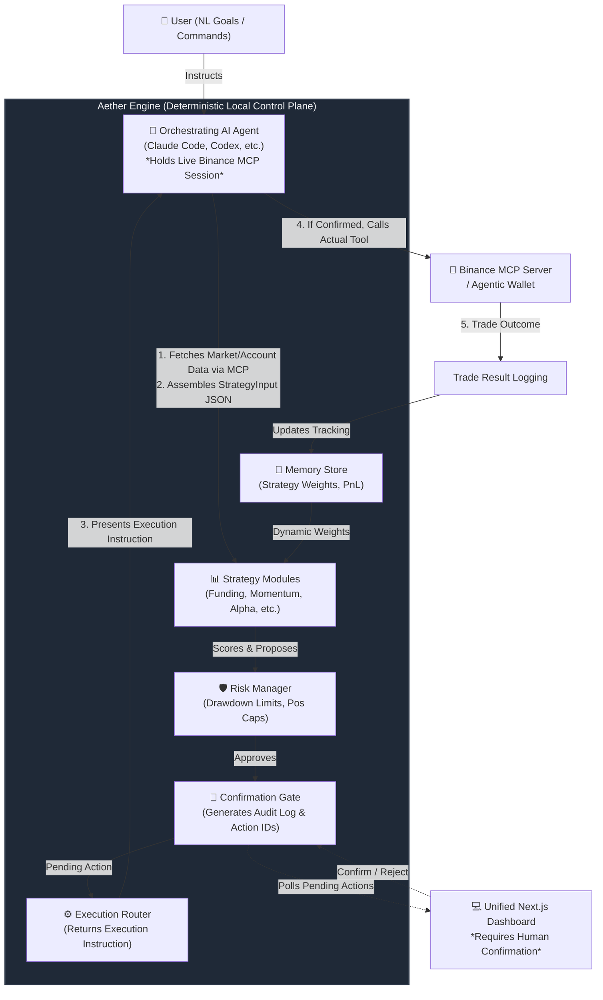

# Aether — Adaptive Cross-Market Intelligence Agent

**Built by mjx** | [Twitter / X](https://x.com/mjxxbt) | [GitHub](https://github.com/mjxxbt/aether)

> **Binance Agent OS Mini Hackathon — Track A Primary Submission**  
> Aether is a safety-first AI-agent workflow built around **Binance Agent OS**, the **Binance MCP Server**, **Agentic Wallet**, and **Skills Hub**. The repository can support an orchestrating agent's connected-MCP workflow, but cloning this repository alone is not a Track B submission.

---

## 🚀 Pitch

**Aether is a transparent, adaptive Binance trading copilot that turns live market and account context into risk-sized, explainable proposals — then requires a human confirmation before any Binance action can happen.**

## 📖 Description

Aether combines Binance Agent OS integrations with a deterministic local engine for multi-strategy market analysis, risk sizing, performance memory, and human-confirmed execution. An orchestrating AI agent fetches live Binance data through MCP and Skills, the engine scores opportunities and creates auditable action IDs, and the dashboard lets the user inspect rationale, limits, paired legs, and execution instructions before deciding. **The engine has no credentials and cannot place trades by itself.**

## 💎 Value Proposition

Most trading agents compress research, decision-making, and execution into a single opaque step. **Aether separates those responsibilities.**  
Binance Agent OS provides the live account, market, wallet, and skills surfaces; Aether adds a repeatable intelligence and safety layer; the user remains the final authority for every write action. This makes the workflow inspectable, testable, and demonstrable even in paper mode.

---

## 🏗️ Architecture & Workflow

Aether is designed with a strict **trust boundary**. The recommended implementation style for Agent OS is a tool-calling agent loop running inside Claude Code / Cursor / Codex, which natively holds the MCP and Skills Hub connections. So instead of re-implementing an MCP client here, **this repo is the deterministic core**.



### Trust Boundary & Safety
The strategy, risk, memory, and execution modules are intentionally **credential-free** and have **no trading-write access**. The optional ingestor reads public Binance market data for the live demo, but never receives API keys or places orders. The only path from "the engine thinks this is a good trade" to "money moves" runs through:
1. The risk manager's deterministic caps.
2. A written confirmation summary that must be shown to the user.
3. The orchestrating agent's own MCP/Skills tool call, which only happens after an explicit `confirmed` status exists in the audit log.

---

## 🧠 Deep Dive: Core Components

### 1. The Intelligence & Analysis Layer
Aether does not sit idle. Every time it scans, it executes concurrent API requests to fetch real-world data:
- **Dynamic Market Discovery:** Connects to live Binance APIs to instantly discover top-volume USDT pairs.
- **CEX Data:** The agent supplies account/market context via MCP.
- **On-chain Data (Skills Hub):** Connects to the Binance Agent OS Skills Hub to run `meme-rush` and `query-token-audit`.
- **Prediction Markets:** Discovers active binary prediction markets via Agentic Wallet.

### 2. Strategy Weighting & Memory
Starts every strategy at weight `1.0`. Each closed trade nudges it based on performance:
- **`+0.05` per win**, **`-0.08` per loss** (capital preservation bias).
- Three consecutive losses force an auto-pause (`weight = 0`).
- The Memory Store (`data/memory.json`) also tracks a real-time equity curve and on-chain address cooldowns.

### 3. Execution Modes & Data Context
Aether labels data context independently so demo data can never be mistaken for a real account handoff:

| Context | Typical Source | Execution Mode | Can produce a live instruction? |
| :--- | :--- | :--- | :--- |
| `mcp_live` | Funded Binance MCP account or real Agent OS wallet | `live` | **Yes**, after human confirmation |
| `mcp_live` | Real MCP account with zero/dust funds | `paper` | No |
| `demo` | Public REST, offline fixture, non-MCP scenario | `paper` | No |

---

## 🚀 Quickstart & Reproduction

Both engine and dashboard dependencies must be installed. Use Node.js 22 or newer.

```bash
# 1. Install dependencies
npm install
(cd web && npm install)
npm run build

# 2. Run the tests to verify deterministic behavior
npm test

# 3. Start the deterministic, network-free demo
npm start -- demo --offline

# 4. In a second terminal, start the Dashboard
npm run dashboard
# Open http://localhost:3000
```

> **Note:** Keep the dashboard private. It is designed for a local hackathon demo and has no built-in user authentication. Bind it to localhost or place it behind an authenticated, private network before exposing it beyond your machine.

### Live Mode Setup
To run live, connect the Binance MCP server in your agent environment:
```bash
claude mcp add binance-mcp-server --transport http https://agent.binance.com/mcp/agentic
npx skills add https://github.com/binance/binance-skills-hub
```
Then open `AGENT.md` in that session and follow the orchestrator loop described there.

---

## 🛠️ CLI Reference

```text
set-goals --goals <file|json>       Save risk goals to memory
score --scenario <file|json>        Run strategy modules, print weighted opportunities
propose --scenario <file|json>      Create demo or explicitly MCP-context proposals
propose --portfolio <file|json>     Use a sanitized Binance MCP account snapshot
confirm --id <id>                   Internal dashboard confirmation step (not execution)
instruction --id <id>               Retrieve and revalidate a confirmed instruction
reject --id <id>                    Reject a pending action
pending                             List all currently pending actions
reject-all                          Reject all pending actions (explicit cleanup)
record-trade --trade <file|json>    Log a closed trade outcome and update strategy weights
report                              Print strategy performance + full audit log
reset-strategy --strategy <id>      Reset a paused/underperforming strategy's memory
backtest --data <klines.json>       Run the backtest harness on historical klines
demo                                Run a public-market paper demo
```
*Tip: Add the `--json` flag for machine-readable output on all commands.*

---

## ✅ What's Implemented (Hackathon Scope)

### MVP
- **Natural-language goal handling** (via `AGENT.md` + `set-goals`)
- **Live market data + account status** via MCP
- **Eight strategy modules:** funding-rate, neutral funding, momentum, on-chain alpha, convert/yield, prediction markets, portfolio rebalance, sentiment.
- **Confirm-before-execute** on every trade/transfer with durable audit log.
- **Performance memory** and dynamic strategy weighting with auto-pause.
- **Risk manager:** drawdown circuit breaker, position/on-chain caps, leverage ceiling.

### Enrichments
- **Test suite (Jest)** and Zod input validations.
- **Delta-neutral funding strategy:** paired spot + perp opportunity with a two-phase `pairedLegInstruction`.
- **On-chain alpha & momentum refinements:** tiered sizing with address-level cooldowns and RSI-style overextension filters.
- **CLI UX improvements:** `--json` flag, JSONL event log.

### New Modules
- **Prediction market strategy** routing through Agentic Wallet.
- **x402 payment example** full proposal/confirm flow.
- **Backtest harness** stepping through historical klines.
- **Unified Next.js Web Dashboard** providing visual equity tracking, strategy performance, and interactive Confirm/Reject controls with a "Deep Dive" modal.

---

## 📂 Documentation Directory

| Document | Purpose |
| :--- | :--- |
| **[AGENT.md](AGENT.md)** | Orchestrating-agent instructions (Start here if using Codex / Claude Code) |
| **[GETTING_STARTED.md](docs/GETTING_STARTED.md)** | Install and first run |
| **[AGENT_OS_INTEGRATION.md](docs/AGENT_OS_INTEGRATION.md)** | Agent OS integration and live-proof workflow |
| **[OPERATIONS_RUNBOOK.md](docs/OPERATIONS_RUNBOOK.md)** | Live, paper, and recovery procedures |
| **[API.md](docs/API.md)** | Local dashboard API reference |
| **[architecture.md](docs/architecture.md)** | Diagram + trust boundary |
| **[SECURITY_AND_SAFETY.md](docs/SECURITY_AND_SAFETY.md)** | Threat model and emergency procedure |
| **[FAQ.md](docs/FAQ.md)** | User and judge FAQ |

---

> **Safety Warning:** The agent operates only inside an isolated Agentic sub-account; no external withdrawals are possible via MCP. Every non-read action requires explicit user confirmation. Fund only risk capital into the Agentic sub-account. **This is experimental software, not financial advice.**

**Key Resources:** [Agent OS](https://www.binance.com/en/agent-os) | [MCP Server Docs](https://developers.binance.com/en/docs/agent-native/mcp-server) | [Agentic Wallet](https://developers.binance.com/en/docs/products/agentic-wallet/welcome) | [Skills Hub](https://developers.binance.com/en/docs/sdks-tools/integrations/skills-hub)
